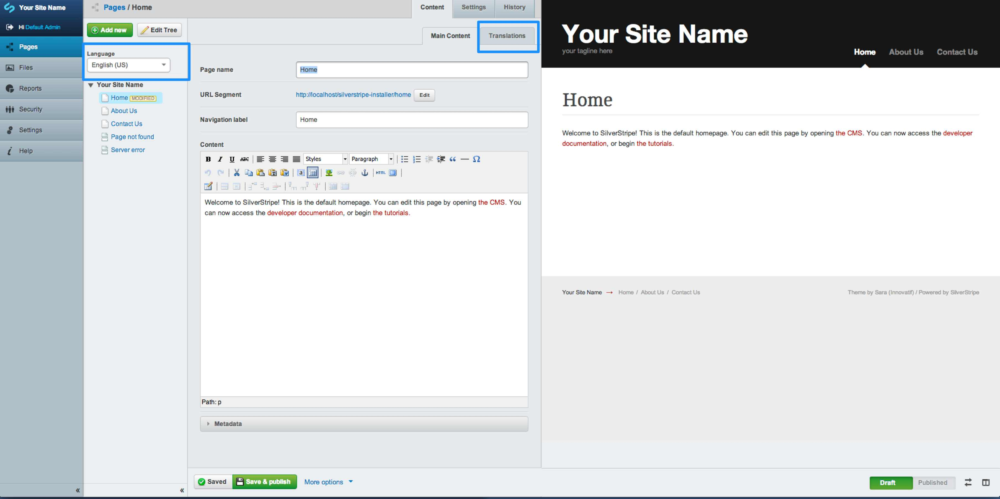

# Understanding translatable content

The SilverStripe Translatable module allows you to create and edit multiple pages in various languages. This module also adds the ability for your users to select which language of a page they wish to view.

Notes:

The SilverStripe Translatable module does not translate content automatically, content authors will need to enter the translated content manually for each translated page.

To begin translating content select a page in your site tree from the "Pages" admin. You can see in the below image:

* The language drop down above your site tree - This allows you to select which translated pages to edit
* The 'Translations' tab - This allows you to create a translated version of the selected page

