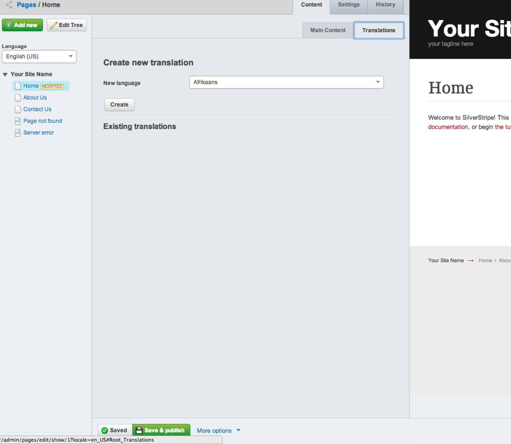
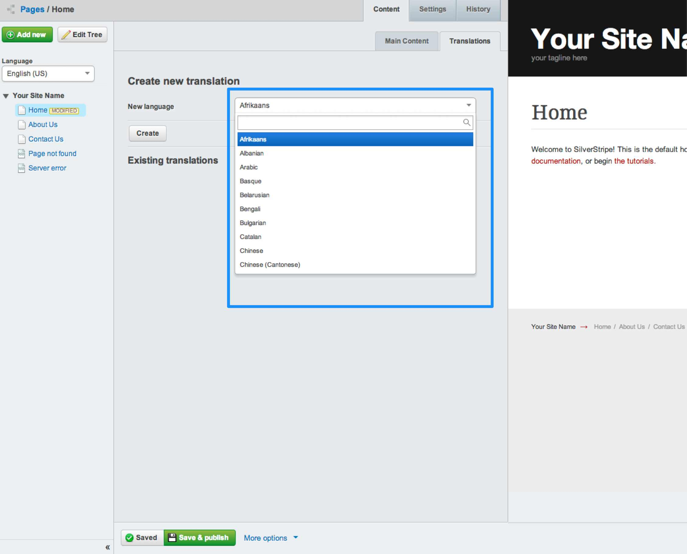
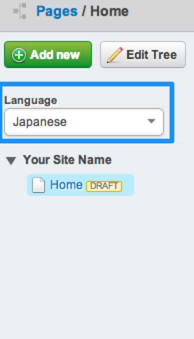
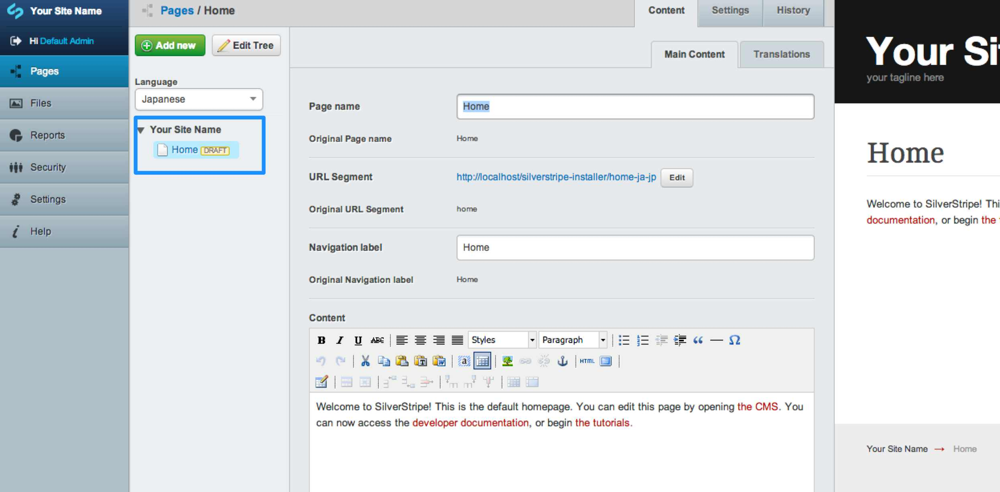
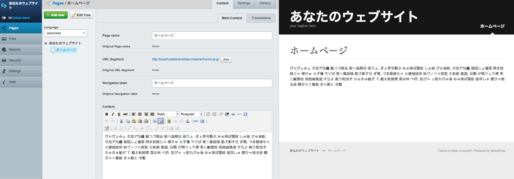

# Translating content

To translate a selected page, click on the 'Translations' tab. 

Then select the desired language you want to translate the content into from the 'Language' drop down field.

Then click 'Create'.

You will then be presented with a new site tree in the "Pages" admin containing a duplicated page for the language you selected:

You can now edit this page's content with the desired translated content. You can enter translated content directly into each field of the page, for example you can enter translated content into the Page Name, Navigation Label and content fields.

Just like publishing your standard content, click 'Save & Publish' and you now have a translated version of the original page you selected.