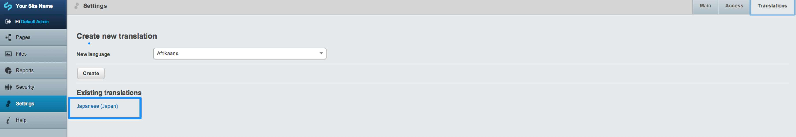
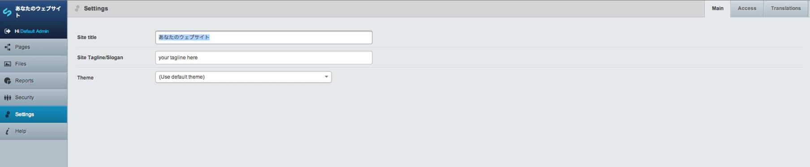

# Translating your site title and settings

To translate your site title and settings, select 'Settings' from the left menu, then click the 'Translations' tab, then select the language from the list of existing languages you wish to edit.

You can then add your translated content into each field:

